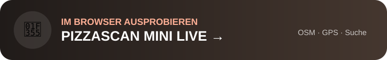

  

<h1 align="center">PizzaScan 2.3.1</h1>

<strong>Gute Pizza finden · offene Bewertungen filtern · Fotos lokal analysieren</strong>

Deutsch · English · Italiano · Español · Français

  

## Direkt starten

<table>
<tr>
<td width="50%" align="center">

 <strong>Android-Testversion 2.3.1</strong>
</td>
<td width="50%" align="center">

 <strong>Mini Live im Browser</strong>
</td>
</tr>
</table>

<strong><a href="https://raw.githubusercontent.com/chekento/Pizzascan/main/downloads/PizzaScan-2.3.1-Test.apk">⬇ PizzaScan-2.3.1-Test.apk herunterladen</a></strong>
&nbsp; · &nbsp;
<strong><a href="https://raw.githack.com/chekento/Pizzascan/main/docs/index.html">🌐 Mini Live öffnen</a></strong>

<a href="downloads/SHA256SUMS-2.3.1.txt">SHA-256</a> ·
<a href="docs/Datenschutz.md">Datenschutz</a> ·
<a href="docs/Offene-Bewertungen.md">Offene Bewertungen</a> ·
<a href="store/TESTPLAN.md">Testplan</a> ·
<a href="store/PLAY-CONSOLE.md">Google Play</a>

> **Wichtig:** Die öffentliche Downloaddatei wird vom CI-Workflow aus genau der APK veröffentlicht, die zuvor im Android-16-Emulator getestet wurde. Dadurch kann die Startseite nicht mehr versehentlich auf eine ältere Test-APK zeigen. Die Mini-Live-Demo ist zusätzlich direkt aus dem Repository ausführbar und benötigt deshalb keine aktivierte GitHub-Pages-Site.

## Neu in 2.3.1

- ⭐ **Mindestbewertung 0,0–5,0 in 0,1-Schritten**, z. B. nur Orte ab **4,6 / 5**.
- 🌱 **Mangrove / Open Reviews** als kostenlose offene Bewertungsquelle; Orte ohne offene Bewertung separat ein-/ausblendbar.
- ↗ **Google Maps, Tripadvisor und Yelp** als externe Portal-Suchlinks in Restaurantdetails; deren Bewertungen werden nicht kopiert.
- 📍 **stabilere Kartenmarker** beim Zoomen und Verschieben.
- 🔎 einblendbare **Restaurant-/Pizzeria-Suche** mit Ort-/Adresssuche.
- 🕒 Filter wie **nur geöffnet**, Suchradius, Ortstypen und weitere Karteneinstellungen.
- 🧭 kompakter unterer Bereich mit **Karte** und **Fotobewertung**.
- 🌍 vollständige Oberfläche in **DE / EN / IT / ES / FR**.
- 🤖 persistente Offline-Modellablage unter Android: ein bereits geladenes Modell bleibt nach normalem App-Neustart und Cache-Bereinigung erhalten.

## Hauptfunktionen

| Funktion | PizzaScan Android |
|---|---|
| 🍕 Karte | OpenStreetMap, GPS, Emoji-Marker, Pizzerien und Restaurants |
| ⭐ Bewertungen | offene Bewertungsdaten + Mindestwert-Filter |
| 📍 Details | Adresse, Kontakt, Öffnungszeiten, externe Bewertungsportale |
| 📷 Fotoanalyse | 25 sichtbare Kriterien, Skala 0,1–10,0 |
| 👥 Perspektiven | 100 simulierte Bewertungsprofile auf denselben Modellwerten |
| 🤖 Lokale KI | CLIP B/32, CLIP B/16 oder SigLIP B/16 via ONNX/WASM |
| ✍️ Review Builder | eigene Erfahrungen zu Essen, Service, Atmosphäre usw. |
| 🌐 Mini Live | kleine Browserfassung ohne große Offline-KI-Modelle |

## Bewertungsfilter

Unter **Einstellungen → Offene Ortsbewertungen → Mindestbewertung** wird der gewünschte Grenzwert gesetzt. Der Filter wirkt auf Karte und Liste. Bei `0` ist er deaktiviert. Bei aktivem Grenzwert können Orte ohne bekannte offene Bewertung bewusst zusätzlich eingeblendet werden.

Die offenen Daten stammen aus **Mangrove / Open Reviews**. Google Maps, Tripadvisor und Yelp werden nur als externe Links geöffnet. Details zu Quelle, Lizenz und Berechnung: [docs/Offene-Bewertungen.md](docs/Offene-Bewertungen.md).

## Fotoanalyse

Die Fotoanalyse läuft lokal auf dem Gerät. Sie ist ein experimenteller visueller Index und keine wissenschaftliche Geschmacks- oder Qualitätsmessung. PizzaScan bewertet sichtbare Bildmerkmale anhand von 25 Kriterien. Die 100 Profile sind **100 simulierte Gewichtungsperspektiven**, keine 100 realen Menschen und keine 100 unabhängigen KI-Gutachten.

Die Modelle werden erst nach ausdrücklicher Bestätigung heruntergeladen und anschließend im privaten Android-App-Speicher gehalten. Kein KI-Abo und kein API-Key erforderlich.

## Technik und Test

- Android 8+ (`minSdk 26`), Target SDK 36.
- WebView-App mit gepackten Web-Assets.
- OpenStreetMap / Overpass, Photon, Leaflet.
- CI-Tests für Ratings, Suche, Navigation, i18n, Marker, Runtime-Assets und lokale Modelle.
- Android-16-Emulator-Smoke-Test vor Veröffentlichung der öffentlichen 2.3.1-Test-APK.
- Der aktuelle Workflow veröffentlicht anschließend `downloads/PizzaScan-2.3.1-Test.apk` samt SHA-256-Prüfsumme.

Die vollständigen Quellen liegen unter `web/` und `app/`. Play-Store-Vorbereitung und Testplan befinden sich unter `store/`.

---

<strong>By KoSch of <a href="https://kosch.cloud">kosch.cloud</a> based on <a href="https://pizzascan.on.websim.com">pizzascan.on.websim.com</a> ❣️</strong>
