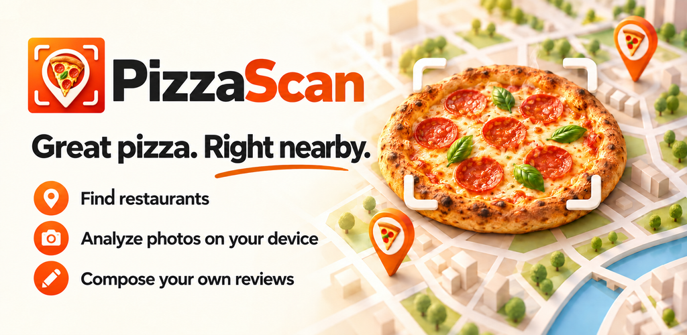

  

<h1 align="center">PizzaScan 2.3.4</h1>

<strong>Gute Pizza finden · Restaurants und POIs präzise suchen · Bewertungen filtern · Fotos lokal analysieren</strong>

Deutsch · English · Italiano · Español · Français

  

## 📱 PizzaScan direkt installieren

  <a href="https://raw.githubusercontent.com/chekento/Pizzascan/main/downloads/PizzaScan-2.3.4.apk"><strong>⬇️ PizzaScan 2.3.4 APK herunterladen</strong></a>

<strong>Version 2.3.4 · Build 26 · Android 8+ · Paket cloud.kosch.pizzascan</strong>

Die aktuelle Direkt-APK trägt in App, Dateiname und Android-Paket nur den Namen **PizzaScan**. Sie enthält die vollständige Karten-/POI-Suche, Ratingfilter, Restaurantdetails, Review Builder, fünf Sprachen und die lokale Fotoanalyse. Die veröffentlichte APK wird in CI signaturgeprüft, aus der tatsächlich gebauten APK heraus UI-getestet und zusätzlich auf Android 16 installiert und gestartet.

<a href="downloads/SHA256SUMS-2.3.4.txt"><strong>SHA-256</strong></a>
&nbsp; · &nbsp;
<a href="CHANGELOG.md"><strong>📝 Changelog</strong></a>
&nbsp; · &nbsp;
<a href="downloads/README.md"><strong>📦 APK-Archiv</strong></a>
&nbsp; · &nbsp;
<a href="https://raw.githack.com/chekento/Pizzascan/main/web/index.html"><strong>🌐 Browser-Version</strong></a>

## 🔎 Präzise POI- und Restaurantsuche

PizzaScan trennt **Discovery** und **Filterung** strikt. Zuerst werden gastronomische POIs geladen und normalisiert; erst danach wirken Öffnungs-, Typ- und Bewertungsfilter. Dadurch verschwinden Restaurants nicht mehr schon während der Datenerfassung wegen alter Filterzustände.

**Build 26 stellt alle ursprünglich vorgesehenen Suchgruppen wieder vollständig her:**

- 🍕 **Pizzeria** – bestätigte Pizza-/Pizzeria-Orte und Pizzaautomaten werden anhand der OSM-Merkmale erkannt.
- ☕ **Café** – sucht semantisch nach `amenity=cafe`, auch wenn „Café“ nicht im Namen steht.
- 🍔 **Imbiss** – sucht nach `fast_food` / Schnellrestaurant, unabhängig vom Namen.
- 🚚 **Foodtruck** – berücksichtigt `food_truck` und mobile Gastronomie.
- 🤖 **Pizzaautomat** – fragt Pizza-Vending-Tags ausdrücklich ab.
- 🍽️ **Weitere Orte** – normale Restaurants, Takeaway, Food Courts, Bars, Pubs und Biergärten bleiben eigene Kandidaten und werden nicht fälschlich als Pizzeria umetikettiert.
- ⭐ **Gemerkt** – durchsucht die auf dem Gerät gemerkten Orte.
- ✓ **Besucht** – durchsucht lokal bestätigte/bewertete besuchte Orte.
- 📍 **Dein Standort** – die gesetzte GPS-Position ist über die Suche direkt erreichbar.

Bei einer ausdrücklich abgesendeten Suche wird nicht nur Autocomplete verwendet. PizzaScan gleicht den Suchbegriff zusätzlich direkt gegen OpenStreetMap/Overpass ab, vergleicht **Kategorie, Name, Adresse, OSM-Identität und Entfernung**, dedupliziert gleiche POIs anhand ihrer OSM-ID und sortiert exakte Namens-/Ortsübereinstimmungen nach vorn. Photon bleibt für Orts-/Adresssuche und Vorschläge erhalten; bei einer abgesendeten Suche kann kontrolliert Nominatim als Fallback einspringen.

Beispiele wie **„Pizza Max Ahrensburg“**, **„Café“**, **„Imbiss“**, **„Foodtruck“**, **„Pizzaautomat“**, **„Restaurant“**, **„Gemerkt“**, **„Besucht“** oder **„Mein Standort“** werden damit jeweils passend zu ihrer Bedeutung behandelt statt nur als freie Namenssuche.

## 🗺️ Karten-Discovery

Standardmäßig startet PizzaScan breit:

- 10 km Radius
- alle Place-Typen
- keine Mindestbewertung
- kein „nur geöffnet“-Filter
- besuchte Orte werden nicht automatisch ausgeblendet
- benannte Restaurants, Fast Food, Cafés, Foodtrucks, Takeaway, Food Courts, Bars, Pubs und Biergärten werden als Kandidaten berücksichtigt
- Pizzaautomaten werden über `vending=pizza` / `vending:pizza=yes` berücksichtigt
- Pizza-/Pizzeria-/Ristorante-/Trattoria-/Osteria-/Italian-Signale dienen zur Einordnung, nicht als versteckter Default-Ausschluss

Primär werden OpenStreetMap/Overpass-Daten verwendet. Antworten mit weniger als 18 rohen POIs gelten nun als potenziell unvollständig und werden über zusätzliche Overpass-Quellen ergänzt; die Recovery zielt auf bis zu 30 rohe Kandidaten, bevor Photon als Ergänzung eingesetzt wird. Der Photon-Fallback erfindet bei normalen Restaurants, Cafés oder Foodtrucks keine Pizza-Eigenschaft mehr. Android verwendet für Overpass einen nativen HTTPS-Transport mit fester Host-Allowlist.

## ⭐ Bewertungen und Restaurantdetails

- Mindestbewertung 0,0–5,0 in 0,1-Schritten
- offene Bewertungen über Mangrove / Open Reviews
- externe Links zu Google Maps, Tripadvisor und Yelp
- optionale Google Places API mit eigenem Key für Google-Ratingdaten und bis zu fünf Rezensionen
- Adresse, Telefon, Website, Speisekarte, Öffnungszeiten, Ausstattung und OSM-Quelle soweit in den Quelldaten vorhanden
- eigene Rezensionen bleiben im lokalen Review Builder

## 📷 Lokale Fotoanalyse

Die Bildanalyse läuft lokal auf dem Gerät. Zur Auswahl stehen **CLIP ViT-B/32**, **CLIP ViT-B/16** und **SigLIP Base Patch16-224** via ONNX/WASM. Das ausgewählte Modell wird erst nach Bestätigung heruntergeladen und anschließend im privaten persistenten App-Speicher gehalten.

Die Fotoanalyse verwendet 25 sichtbare Kriterien und 100 simulierte Gewichtungsperspektiven. Diese Perspektiven sind keine 100 realen Experten und keine unabhängigen Gutachten. Fotos werden für die Analyse nicht an einen PizzaScan-Server hochgeladen.

## 📦 Versionen

| Version | Status | Download |
|---|---|---|
| **2.3.4 · Build 26** | aktuelle Direktversion | [⬇️ PizzaScan-2.3.4.apk](https://raw.githubusercontent.com/chekento/Pizzascan/main/downloads/PizzaScan-2.3.4.apk) |
| 2.3.3 | Archiv / Regression | [Archiv öffnen](downloads/README.md) |
| 2.3.2 | Archiv / Regression | [Archiv öffnen](downloads/README.md) |
| 2.3.1 | Archiv / Regression | [Archiv öffnen](downloads/README.md) |
| 2.3.0 | Archiv / Basisstand | [Archiv öffnen](downloads/README.md) |

> **Signaturhinweis:** Die direkt von GitHub installierbare APK wird für die Direktinstallation signiert. Die spätere Google-Play-Ausgabe kann mit einer anderen Release-Signatur ausgeliefert werden. Ein Wechsel kann deshalb eine Neuinstallation erfordern. Persönliche lokale Daten vorher exportieren/sichern.

## Google Play

Das Repository erzeugt zusätzlich ein validiertes Release-AAB für die Google-Play-Vorbereitung. Die Google Group **PizzaScan Beta Testers** ist vorbereitet; der geschlossene Play-Track wird erst freigegeben, wenn die aktuelle Direktversion auf realen Geräten insbesondere bei POI-Vollständigkeit, Suche, Standort, Ratings und Offline-KI abgenommen ist.

<a href="https://groups.google.com/g/pizzascan-beta-testers"><strong>PizzaScan Beta Testers</strong></a>
&nbsp; · &nbsp;
<a href="store/PLAY-CONSOLE.md"><strong>Play-Console-Checkliste</strong></a>
&nbsp; · &nbsp;
<a href="docs/Datenschutz.md"><strong>Datenschutz</strong></a>

## Technik

- Android 8+ (`minSdk 26`), Target SDK 36
- Paket: `cloud.kosch.pizzascan`
- WebView-App mit gepackten lokalen Web-Assets
- OpenStreetMap / Overpass, Photon, kontrollierter Nominatim-Fallback, Leaflet
- Mangrove / Open Reviews
- CLIP / SigLIP lokal via ONNX/WASM
- CI: Unit-/Regression-/Playwright-Smokes, APK-Inhaltsprüfung, Signatur-/Package-Prüfung, Android-16-Installations- und Startprüfung

Die Quellen liegen unter `web/` und `app/`. Play-Store-Vorbereitung und Store-Assets befinden sich unter `store/`.

---

<strong>By KoSch of <a href="https://kosch.cloud">kosch.cloud</a> based on <a href="https://pizzascan.on.websim.com">pizzascan.on.websim.com</a> ❣️</strong>
